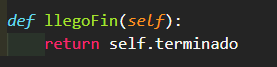

# Genetic-Algorithm for Graph Coloring Problem #
This repo contains the program and report document about the implementation in Python of a Genetic Algorithm to solve the graph coloring problem.

### Developed by Damián García ###
The information in this document is in Spanish since I'm from Mexico and the project was for my Artificial Intelligence Techniques Class

## INTRODUCCIÓN ##
En este reporte se presenta el proyecto final para la materia de Técnicas de Inteligencia Artificial, el cuál consiste en seleccionar uno de los tres ejercicios del documento visto en clase llamado Algoritmos Genéticos (Ejercicios) e implementar un RGA, es decir, un algoritmo genético bidimensional para darle solución al ejercicio escogido. Para el proyecto final escogí el ejercicio número 3 del documento, el cuál se describirá a detalle a continuación, pero en resumen es el problema del coloreo de un grafo conexo y no dirigido de n vértices. Para la implementación de este proyecto, se usó el lenguaje de programación Python en su versión 3.8.5 y el IDE Visual Studio Code.

## DESARROLLO ##
### _DESCRIPCIÓN DEL EJERCICIO_ ###
EJERCICIO3: Proponer un Algoritmo Genético Bidimensional para realizar el coloreo de un grafo no dirigido, conexo no pesado, con 3 colores diferentes. Este problema requiere mucho tiempo para obtenerse una solución, en especial cuando la cantidad de vértices es grande (superior a 20 vértices, donde se requieren varios días o semanas de cómputo). (Sugerencia: use un arreglo de n elementos para representar cada vértice, y en cada elemento puede ir uno de 3 posibles colores).

### _COLOREO DE UN GRAFO_ ###
El problema del coloreo de un grafo consiste en, dado un grafo G conexo, unidireccional y no pesado de n vértices y m aristas, asignar un color a cada vértice del grafo de tal forma que ningún vértice adyacente tenga el mismo color. Para este ejercicio se pide que los colores a usar sean solo 3, sin embargo, hay otras versiones del problema del coloreo del grafo en el que se tiene que optimizar el número de colores que se usan para colorear los vértices de un grafo. Para efectos prácticos y de este ejercicio, se trabajará únicamente con los 3 colores que pide el ejercicio. Un ejemplo que ilustra lo comentado anteriormente se muestra a continuación:
#### GRAFO ANTES DEL COLOREO ####

#### GRAFO DESPUÉS DEL COLOREO ####

### _IMPLEMENTACIÓN_ ###
Como se mencionó en la introducción de este reporte, se utilizó el lenguaje de programación Python 3.8.5 y el IDE Visual Studio Code. El proyecto está compuesto por 2 clases principales; Clase Cromosoma y Clase AlgoritmoGenetico. A continuación, se presenta una descripción de cada clase y los métodos que la componen.

#### _CLASE CROMOSOMA_ ####
Esta clase simulará un cromosoma en el algoritmo genético y dentro de los atributos más importantes se encuentra el RV, SV y CV, estos vectores le dan la estructura al algoritmo genético bidimensional. La clase Cromosoma también cuenta con un atributo llamado fitness, el cuál guarda el puntaje asignado a este cromosoma por medio de una función fitness.
En la siguiente imagen se muestra como se realiza la conexión de los tres vectores del cromosoma para un ejemplo en el que se tiene un Grafo de 5 vértices y 3 colores.

El RV guarda los tres colores posibles, el SV guarda los n nodos que conforman al grafo, para este ejemplo, SV tiene un valor de 5 y cada elemento está enumerado desde 1 hasta n. El CV, como ya se expuso en el documento sobre el RGA, es el vector que mantiene las conexiones entre el RV y el SV. Como se puede observar en la imagen de arriba, CV guarda la conexión de cada nodo con un respectivo color de tal forma que se almacena en cada posición de CV el número del color del nodo y el número del nodo en cuestión.
Es importante mencionar que los operadores de Crossover y mutación serán aplicados únicamente al CV, pues para nuestra implementación, este vector es el que guarda toda la información importante para encontrar una solución óptima.
La implementación en código de lo anterior se muestra en la siguiente imagen.

Los dos ciclos for se encargan tanto de llenar el RV como el SV así como también de generar valores aleatorios para el CV, esto es, genera las conexiones aleatorias entre el RV y el SV.
El constructor de la clase recibe como parámetro los n nodos y los k colores para así llenar los RV, SV y CV.

#### _CLASE ALGORITMOGENETICO_ ####

Esta clase es la que contiene todos los atributos y métodos necesarios para realizar el algoritmo genético bidimensional. A continuación, se explica todo lo que contiene esta clase.

Los atributos y su función se enlistan de la siguiente forma:
  * Self.poblacion: Arreglo que guardará cada uno de los cromosomas generados, es decir, arreglo que representa a toda la población.
  * Self.ruleta: Arreglo que sirve para representar la selección por ruleta. En este arreglo se guardan los cromosomas p veces, donde p es un porcentaje que se obtiene de acuerdo al valor fitness de cada cromosoma, esto es, un cromosoma con fitness alto será agregado más veces a este arreglo y por lo tanto tendrá más posibilidades de ser elegido en la selección y crossover.
  * Self.DosMejoresCromo: Este arreglo guardará a los dos mejores cromosomas de cada generación para ser agregados a la siguiente.
  *	Self.noPoblacion: Variable para almacenar el tamaño de la población
  *	Self.generaciones: Variable para almacenar el número de generaciones totales a realizar.
  *	Self.puntajePerfecto: Esta variable guarda el valor fitness perfecto al que se espera llegar con el paso de las generaciones.
  *	Self.crossoverRate: Almacena el porcentaje para el crossover.
  *	Self.mutationRate: Almacena el porcentaje para la mutación.
  *	Sel.terminado: Variable booleana para saber si es que ya se llegó al valor fitness perfecto en algún cromosoma de la población.
  *	Self.mejor: Variable que almacenará al mejor cromosoma de cada generación.
  *	Self.peor: Variable que almacenará al peor cromosoma de cada generación.
  *	Self.edges: Este es un arreglo que contiene todas las aristas del grafo.
  *	Self.n: Variable para almacenar el número de nodos del grafo.
  *	Self.k: Variable que guarda el número de colores a usar.
  *	Self.grafo: Variable que guardará el grafo creado con la biblioteca networkx para ser mostrado al final de toda la ejecución del RGA.
  *	Self.grafo.add_edges_from(self.edges): Almacena todas las aristas en el grafo.
  *	Self.mapaDeColor: Es un arreglo que almacenará los colores para pintar a cada uno de los nodos del grafo creado con la biblioteca networkx.
 	
  Ahora se empezará a describir cada una de las funciones incluidas en esta clase.

#### _FUNCIÓN CREARPOBLACION_ ####

En esta función se van a crear Cromosomas para ser agregados a la población. Esto se consigue con un for loop empezando en 0 y terminando en el número de población total menos 1. El código es el siguiente.

#### _FUNCIÓN CALCULAFITNESS_ ####

La función se encarga de checar a cada cromosoma de la población y calcular su valor fitness. Este valor fitness se calcula recorriendo cada unión del grafo y sumando 1 a una variable conteo si es que los dos nodos de la conexión en la que estamos contienen colores diferentes y 0 si el color de estos dos nodos es el mismo. Al final, después de recorrer cada una de las conexiones del nodo dividimos la cantidad sumada entre el número de aristas del grafo para así obtener un valor comprendido entre 0 y 1. Su código es el siguiente:

#### _FUNCIÓN CROSSOVER_ ####

Esta función realiza la operación del crossover entre dos padres. El crossover implementado es el de un punto y en la función se genera un punto de cruce aleatorio comprendido entre 1 y el número de nodos totales. Parte del padre 1 y del padre 2 serán agregados al hijo en un for loop y el hijo creado es devuelto.

#### _FUNCIÓN MUTACIÓN_ ####

Esta función realiza la mutación a un cromosoma. Esto se consigue generando una posición aleatoria comprendida entre 0 y el número de nodos del grafo menos 1. Después se genera un número aleatorio que representa a un color de los k posibles y se accede al CV del cromosoma para cambiar este color al nodo en la posición aleatoria generada.

#### _FUNCIÓN SELECCIÓN_ ####

Esta función simula la selección por ruleta agregando a cada cromosoma de la población p veces, donde p representa la cantidad basada en el porcentaje de fitness que cada cromosoma tiene. Esto asegura que los cromosomas con mayor fitness sean agregados más veces al arreglo ruleta.

#### _FUNCIÓN EVALUACIÓN_ ####

Esta función se encarga de recorrer cada individuo de la población para obtener el mejor y el peor cromosoma de la generación. Una vez que se obtiene el mejor cromosoma de la generación, el valor fitness de este cromosoma se compara con el valor fitness perfecto, es decir, el valor fitness que deseamos obtener; 100% o 1, en mi implementación del RGA. Si se detecta que el mejor cromosoma de la generación tiene el valor fitness de 100% entonces la variable terminado se pone verdadera y con esto acabaríamos la ejecución del algoritmo.
Esta función también nos guarda los dos mejores cromosomas de cada generación para que estos puedan ser pasados a la siguiente.

#### _FUNCIÓN OPERADORES_ ####

La función operadores se encarga de ejecutar los operadores de crossover y mutación en base a la probabilidad que se tiene para cada uno de estos. Al inicio se mapea el porcentaje de crossover y mutación para poder saber cuántos cromosomas debemos de cruzar y mutar de toda la población total, para después con un for loop realizar estas operaciones como se muestra en la siguiente imagen.

Para el for loop del crossover se seleccionan dos padres aleatoriamente del arreglo ruleta y se compara que no sean padres iguales porque si lo son entonces tendremos que volver a seleccionar otros dos padres. El propósito de lo anterior es tener dos padres diferentes para la cruza. Una vez se tiene el padre 1 y 2 se pasa a ejecutar la función crossover() y se genera un hijo, este hijo se agrega a la población.
Para el for loop de la mutación se escoge aleatoriamente un cromosoma de la población y este se pasa a la función mutacion().
Finalmente, en las últimas dos pociones del arreglo de la población se agregan los dos mejores cromosomas de la generación a la nueva generación.

#### _FUNCIÓN LLEGOFIN_ ####

Esta función nos regresa True si ya se encontró al cromosoma que obtuvo el 100% de precisión y False en caso contrario.

#### _FUNCIÓN PINTAGRAFO_ ####

Esta función se encarga de imprimir el grafo final pintado. Para esto recorremos cada nodo del grafo creado con la biblioteca networx y recorremos cada gen del vector CV del mejor cromosoma y checamos que el vértice del grafo coincida con el vértice que se tiene en el vector CV. Cuando esto se cumpla checamos en el vector CV que número tiene asignado para el color este nodo y así poder agregar al mapaDeColor el color que le corresponde al nodo n. Los números que representan a los 3 colores son los siguientes:

Finalmente, con una función de la biblioteca networkx mostramos el grafo final ya coloreado.

#### _FUNCIÓN INICIAREVOLUCION_ ####

Esta función se encarga de ejecutar todas las fases del RGA. Creamos una nueva población al inicio y dentro de un while que se va a ejecutar mientras no lleguemos al final de las generaciones o al valor fitness deseado, se calcula el valor fitness de cada uno de los individuos de la población, se evalúa a la generación para obtener el mejor y peor cromosoma, se genera la ruleta para la selección y se realizan las operaciones de crossover y mutación con base en los porcentajes definidos al inicio, esto se hace con la función operadores().

Mostramos en la consola la generación en la que se encuentra el algoritmo. Se muestra también el mejor de los cromosomas de esa generación, así como el peor de los cromosomas de la misma generación y se incrementa el contador de generaciones.
Al salir del while se muestra el final del algoritmo y el cromosoma que fue el mejor después de todas las generaciones que se ejecutaron.
Finalmente se muestra el grafo final obtenido llamando a la función pintarGrafo() que nos muestra en pantalla una ventana con el grafo construido a partir del mejor cromosoma obtenido en toda la ejecución del algoritmo.

#### _FUNCIÓN MAIN_ ####

En el main se crea un nuevo objeto de la clase AlgoritmoGenetico y se le pasa como parámetro todos los valores con los que queremos que el RGA trabaje. Estos parámetros ya fueron especificados previamente en el constructor de esta clase. Finalmente se ejecuta la función que realizará todos los pasos de un AG; ag.iniciarEvolucion().

## **PRUEBAS** ##

A continuación, se presentan una serie de pruebas que se realizaron con el RGA implementado. Para estas pruebas se ocuparon diferentes grafos con diferentes números de nodos, conexiones y parámetros generales para ver que tan bien funciona.

#### PRUEBA 1 ####

\# Generaciones | \# Poblacion | Valor fitness deseado | Porcentaje de crossover | Porcentaje de mutacion | \# Nodes | #Número de colores
-------------  | ------------- | --------------------- | ----------------------- | ---------------------- | -------- | ------------------
100            | 100           | 1                     | 0.8                     | 0.1                    | 7        | 3

Aristas del grafo:
(1,2),(1,3),(1,4),(1,5),(1,6),(1,7),(2,4),(2,5),(2,7),(3,4),(3,5),(3,7),(4,5),(4,6),(4,7),(5,6),(6,7)

# ... #

Grafo final construido con base en el mejor cromosoma obtenido:

#### TABLAS COMPARATIVAS ####

#### PRUEBA 2 ####

\# Generaciones | \# Poblacion | Valor fitness deseado | Porcentaje de crossover | Porcentaje de mutacion | \# Nodes | #Número de colores
-------------  | ------------- | --------------------- | ----------------------- | ---------------------- | -------- | ------------------
100            | 10            | 1                     | 0.8                     | 0.1                    | 5        | 3

Aristas del grafo:
(1,2),(1,3),(2,4),(2,3),(3,4),(3,5),(4,5)

# ... #

Grafo final construido con base en el mejor cromosoma obtenido:

#### TABLAS COMPARATIVAS ####

